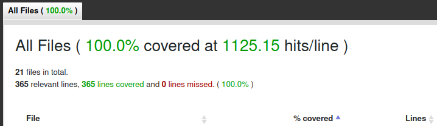

# Daily Coding Problem Solutions

This repository contains my solutions to problems sent by the [Daily Coding Problem](https://www.dailycodingproblem.com/) site, which sends me one coding problem every day. The primary goal of this repository is to document my journey through these problems and share my solutions, primarily written in Ruby.

## Project Structure

Each problem is contained in its own directory, named `problem_XXX` where `XXX` is the problem number. Inside each problem's directory, you will find:

- `solutionXXX.rb`: The Ruby script containing the solution.
- `solutionXXX_spec.rb`: The RSpec test file for the solution.
- `Readme.md`: A markdown file describing the problem.

## Running Tests

Tests are written using RSpec. To run the tests for a problem, navigate to the problem's directory and execute the following command:

```bash
cd problem_001
rspec solution001_spec.rb
```

## Contributing

While this project is primarily for my personal development, I'm open to contributions, suggestions, and discussions on different solutions to these problems. Feel free to open an issue or a pull request if you have any inputs or corrections.

## License
[MIT License](https://opensource.org/licenses/MIT)

## Acknowledgments

Thanks to the "Daily Coding Problem" site for providing these challenging and interesting problems. This repository is not affiliated with the site but serves as a personal project to track and share my solutions.

# Gems and Extra Features

## Simple-Cov report

To run a report use:
```bash
COVERAGE=true rspec
```
The image below is just an example and won't be updated in a regular manner


## Flog
[Flog gem repo](https://github.com/seattlerb/flog)
Flog reports the most tortured code in an easy to read pain report. The higher the score, the more pain the code is in.

If you download the project you can use
```bash
flog . # to run it for the whole project
# or
flog path/to/file.rb # to run it for a specific file
```

Due to the complexity of the challenges, lowering the flog score was not a priority.
I only installed it to experiment with it.
